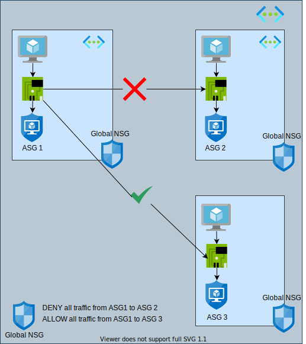
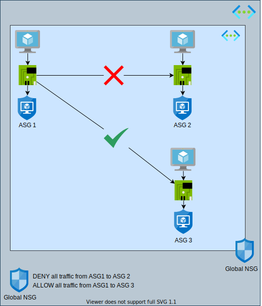
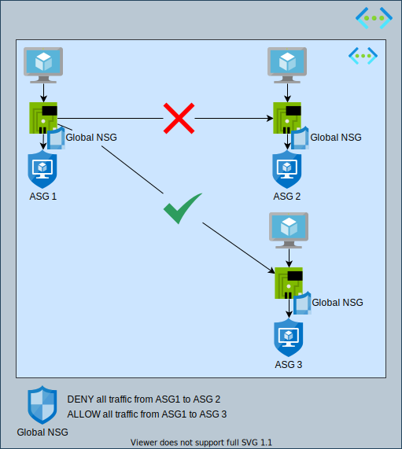

# Azure Application Security Groups

Azure Application Security Groups allow for you to group Virtual Machines together and use that grouping within NSG Rules.

## How to associate a Virtual Machine with an Application Security Group

An Application Security Group (ASG) is a seperate Resources in Azure, that once created can be added to the Network Interfacte Card (NIC) of a Virtual Machine (VM), thereby associating the VM with the ASG.

    resource "azurerm_application_security_group" "asg1" {
      name                = "asg1"
      location            = azurerm_resource_group.rg.location
      resource_group_name = azurerm_resource_group.rg.name
      tags                = var.tags
    }

      resource "azurerm_network_interface_application_security_group_association" "asg1" {
      network_interface_id          = azurerm_network_interface.asg1_vm_nic.id
      application_security_group_id = azurerm_application_security_group.asg1.id
    }

## How to make an Application Security Group effective

To make an ASG effective, the ASG must be added to a network rule within an Network Security Group (NSG), and that NSG must be attached to a network appliance resource.  

Below is an example of utilizing ASGs within the ruleset of an NSG:

    resource "azurerm_network_security_rule" "asg-public-rule" {
      name                                       = "asg-public-rule"
      priority                                   = 100
      direction                                  = "Inbound"
      access                                     = "Allow"
      protocol                                   = "Tcp"
      source_port_range                          = "*"
      destination_port_range                     = "22"
      source_address_prefixes                    = ["24.31.171.98"]
      destination_application_security_group_ids = [azurerm_application_security_group.asg1.id]
      resource_group_name                        = azurerm_resource_group.rg.name
      network_security_group_name                = azurerm_network_security_group.nsg.name
    }

    resource "azurerm_network_security_rule" "asg_deny_to_asg2" {
      name                                       = "asg-deny-to-asg2"
      priority                                   = 110
      direction                                  = "Inbound"
      access                                     = "Deny"
      protocol                                   = "*"
      source_port_range                          = "*"
      destination_port_range                     = "*"
      source_application_security_group_ids      = [azurerm_application_security_group.asg1.id]
      destination_application_security_group_ids = [azurerm_application_security_group.asg2.id]
      resource_group_name                        = azurerm_resource_group.rg.name
      network_security_group_name                = azurerm_network_security_group.nsg.name
    }

    resource "azurerm_network_security_rule" "asg_allow_to_asg3" {
      name                                       = "asg-allow-to-asg3"
      priority                                   = 120
      direction                                  = "Inbound"
      access                                     = "Allow"
      protocol                                   = "*"
      source_port_range                          = "*"
      destination_port_range                     = "*"
      source_application_security_group_ids      = [azurerm_application_security_group.asg1.id]
      destination_application_security_group_ids = [azurerm_application_security_group.asg3.id]
      resource_group_name                        = azurerm_resource_group.rg.name
      network_security_group_name                = azurerm_network_security_group.nsg.name
    }

## Where to attach the Network Security Group?

The NSG can be attached to the VM's NIC or the Subnet the VM is contained, and the effect will be the same as described by the following diagrams.

### Seperate Subnets

### Same Subnet with the NSG on the Subnet

### Same Subnet with the NSG on the VM NIC

